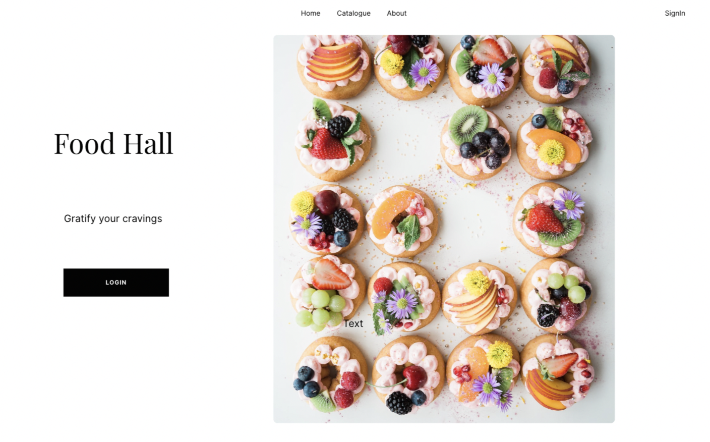
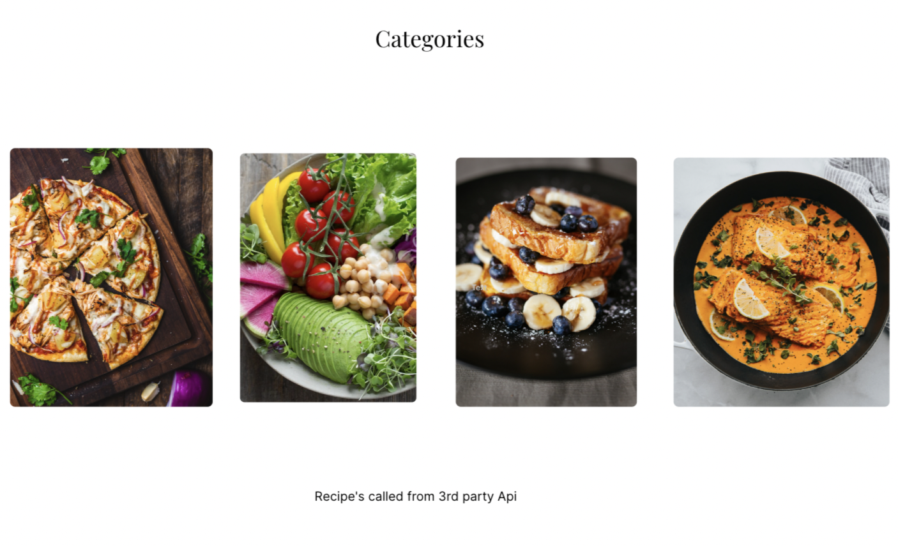

# FOOD HALL

# User Story

- This is a food application meant to provide recipes and allow users to leave reviews on the same
- Users will have to sign-up and login to access the content and leave reviews 

BONUS
- Customers can also place orders for a dish that they like. For this they will be able to add the recipe to the cart
- They will see addtional sections - 'About' and 'Contact us' section

# Technologies Used

1. HTML5
2. CSS
3. Java Script
4. Node and it's packages
5. Mongoose/MongoDB
6. Express

# Layout

1. Home Page

2. Signup/Login Page

3. Food Collection Page

https://web.whatsapp.com/3004e379-4dcd-45e5-a3a5-a65e49a9ab36

#### URL GUIDE

#### Food

| **URL**          | **HTTP Verb**|**Action**|
|------------------|--------------|----------|
| /food/         | GET          | index  
| /food/:id      | GET          | show       
| /food/new      | GET          | new   
| /food          | POST         | create   
| /food/:id/edit | GET          | edit       
| /food/:id      | PATCH/PUT    | update    
| /food/:id      | DELETE       | destroy  

#### Comments

| **URL**          | **HTTP Verb**|**Action**|
|--------------------|--------------|----------|
| /comments/:foodId | POST         | create  
| /comments/delete/:foodId/:commentId      | DELETE          | destroy       

#### Users

| **URL**          | **HTTP Verb**|**Action**|
|------------------|--------------|----------|
| /users/signup    | GET         | new  
| /users/signup    | POST         | create  
| /users/login     | GET         | login       
| /users/login     | POST         | create       
| /users/logout    | DELETE       | destroy   
